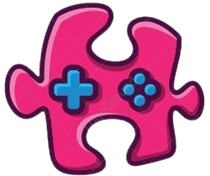

# BitPuzzle: Cryptography Conundrums

Welcome to BitPuzzle, an exciting game that takes you on an adventure into the world of blockchain and cryptography. Solve puzzles, mine blocks, and secure transactions to earn points and enhance your blockchain strength. Embrace the challenges and strive for high scores!

## Table of Contents
- [Features](#features)
- [Getting Started](#getting-started)
  - [Prerequisites](#prerequisites)
  - [Installation](#installation)
  - [Running Locally](#running-locally)
- [Gameplay](#gameplay)
  - [Starting the Game](#starting-the-game)
  - [Solving Puzzles](#solving-puzzles)
  - [Mining Blocks](#mining-blocks)
  - [Securing Transactions](#securing-transactions)
- [Player Management](#player-management)
- [Rules](#rules)
- [Troubleshooting](#troubleshooting)
- [Contributing](#contributing)
- [License](#license)
- [Acknowledgments](#acknowledgments)
- [Contact](#contact)

## Features
- Engaging gameplay that combines blockchain and cryptography challenges.
- Persistent player data with score, blockchain strength, and transaction count.
- Interactive buttons for starting the game, solving puzzles, mining blocks, and securing transactions.
- User-friendly interface with a scoreboard and output section.
- Responsive design for a seamless gaming experience.

## Getting Started

### Prerequisites
- A web browser with JavaScript enabled.
- An internet connection for optimal gameplay.

### Installation
1. Clone the repository or download the ZIP file.
2. Extract the contents to your desired location.
3. Open the `index.html` file in a web browser.

### Running Locally
- If you have a local development server, you can run the game by accessing `http://127.0.0.1:8080` in your web browser.

## Gameplay

### Starting the Game
1. Enter your nickname in the provided input field.
2. Click the "Start Game" button to begin your BitPuzzle adventure.
3. Follow on-screen instructions and prompts.

### Solving Puzzles
- Click the "Solve Puzzle" button to decrypt phrases.
- Answer correctly to earn points and progress in the game.
- Puzzle completion will lead to the generation of a puzzle code.

### Mining Blocks
- Click the "Mine Block" button to answer algebra questions.
- Correct answers will increase your blockchain strength.
- Achieve a target blockchain strength to generate a block code.

### Securing Transactions
- Click the "Secure Transaction" button to enter puzzle and block codes.
- Secure transactions to earn additional points.

## Player Management
- Player data is stored locally using the browser's `localStorage`.
- Players can reset the game and start anew by entering a new nickname.

## Rules

1. **Start Game:** Click the "Start Game" button to initiate your cryptographic journey. This marks the beginning of the game, where you'll face various challenges related to blockchain and cryptography.

2. **Solve Puzzle:** Utilize your cryptographic skills to decrypt challenging puzzles. Each successfully solved puzzle advances your progress in the game.

3. **Mine Block:** Enhance your blockchain strength by clicking the "Mine Block" button. Mining blocks contributes to the overall strength of your blockchain in the game.

4. **Secure Transaction:** Safely conduct transactions by clicking the "Secure Transaction" button. Successfully completing secure transactions adds points to your score.

5. **Have Fun and Enjoy the Journey:** BitPuzzle is more than just a game; it's an exploration into the fascinating worlds of blockchain and cryptography. Embrace the challenges presented, enjoy the journey, and aim for high scores! Consider BitPuzzle as an adventure that combines entertainment with educational elements.

## Troubleshooting
- If you encounter issues, ensure your browser supports JavaScript.
- Clear your browser cache if you experience unexpected behavior.

## Contributing
- Contributions are welcome! Feel free to submit bug reports or feature requests.

## License
This project is licensed under the [MIT License](LICENSE).

## Acknowledgments
- Special thanks to contributors and libraries that made BitPuzzle possible.

## Contact
For questions or feedback, contact the developer:
- queena2512@gmail.com - Queena Lim
- syazz.snow@gmail.com - Mohamad Syazmin
- amirahakma24@gmail.com - Amirah Akma
